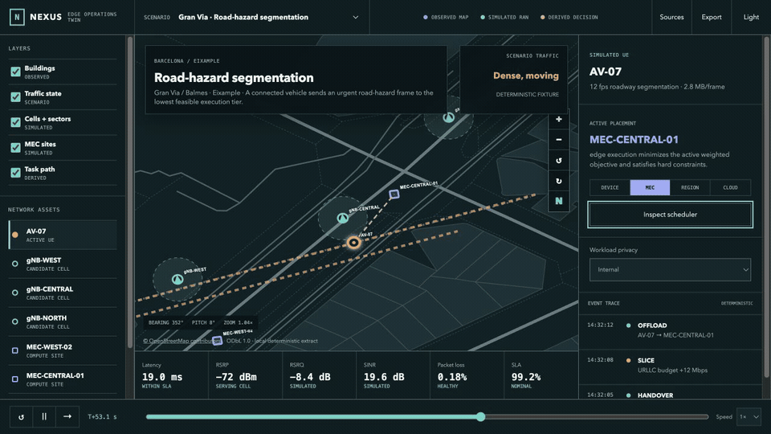
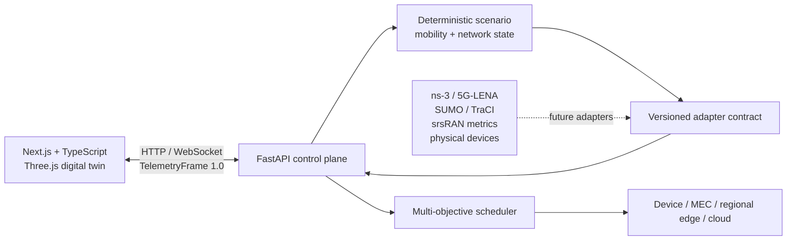

# NEXUS—5G Edge Intelligence Digital Twin

[](https://marinjursic.github.io/edge-intelligence-digital-twin/)
[](https://github.com/MarinJursic/edge-intelligence-digital-twin/actions/workflows/pages.yml)

An interactive 5G edge-computing digital twin that makes task-offload decisions, radio events, and failure recovery visible and testable.

NEXUS—5G models a small autonomous-mobility district: vehicles, a drone, a phone, a camera, a robot, and sensors move or operate inside a 3D city, connect to gNodeB sectors, and generate AI workloads. A transparent multi-objective scheduler places each workload on the device, a nearby MEC node, a regional edge, or the cloud. Injecting a base-station failure immediately changes the radio state, serving cells, queue pressure, task path, and scheduler decision; restoring it emits a separate recovery transition.

## Continuous app walkthrough

[](docs/walkthrough/app-walkthrough.mp4)

[Watch or download the full-resolution MP4](docs/walkthrough/app-walkthrough.mp4)
· [Open the walkthrough poster](docs/walkthrough/app-walkthrough-poster.jpg)

This is one uninterrupted capture of the executable Three.js application. It rotates
the labeled city, changes the scheduler from MEC to cloud execution, applies a
restricted-data policy that safely falls back to the device, returns to the adaptive
policy, and injects a `gNB-CENTRAL` failure. The scene, inventory, active execution
node, task path, recovery bar, latency, loss, jitter, queue depth, SLA, and event
stream change together. The walkthrough then changes the complete WebGL and dashboard
theme during recovery and restores the base station to a distinct healthy state.

The displayed values are deterministic simulator telemetry, not packet-level RF
measurements. The continuous capture demonstrates the real interaction and rendering
path without claiming measured 5G performance.

## Why this project exists

Edge-AI scheduling is a systems problem, not just a model-selection problem. Sending a workload farther away may improve inference accuracy while increasing radio delay, privacy exposure, and cost. Keeping it on-device may protect data while draining battery and missing a latency target. NEXUS—5G makes those trade-offs observable and gives every decision an inspectable score.

The MVP demonstrates:

- a real-time Three.js city/factory-style digital-twin viewport;
- moving vehicles and robot, a drone, phone, camera, sensors, buildings, three gNodeBs, coverage volumes, beams, two MEC nodes, a regional node, cloud, and animated task paths;
- independently selectable device, MEC, regional-edge, and cloud offload paths;
- latency, throughput, packet loss, jitter, queue, energy, accuracy, privacy, SLA, and slice telemetry;
- all five inspectable objective dimensions: latency, energy, monetary cost, privacy risk, and accuracy loss;
- a one-click `gNB-CENTRAL` failure, UE handover, deterministic stabilization, adaptive rerouting, and explicit restoration;
- persistent dark and light interface themes, including separate Three.js scene
  lighting, fog, ground, road, building, grid, window, and label palettes;
- a deterministic Python simulator and multi-objective scheduler;
- one versioned telemetry contract for simulated and future physical sources;
- WebSocket and request/response APIs with generated OpenAPI documentation.

No SDR, mobile core, traffic simulator, external dataset, API key, or GPU is required for the complete demo.

## Quick start

Prerequisites: Node.js 22.13+ and Python 3.11+.

```bash
# Frontend (lockfile-reproducible)
npm ci
npm run dev
```

In a second terminal:

```bash
python3 -m venv .venv
.venv/bin/pip install -e 'api[test]'
npm run api:dev
```

Open [http://localhost:3000](http://localhost:3000). The UI automatically uses the API at `http://localhost:8000`; if it is unavailable, the browser switches to its deterministic local adapter so the demo remains usable. API docs are at [http://localhost:8000/docs](http://localhost:8000/docs).

To point the web app at another API:

```bash
NEXT_PUBLIC_EDGE_API_URL=http://your-api.example npm run dev
```

## Demo walkthrough

1. Drag across the city to rotate the 3D camera.
2. Use the persistent **LIGHT / DARK** control to change both the dashboard and
   the 3D city's materials, atmosphere, lighting, and labels.
3. Watch the white task pulse travel from `AV-07` to the selected execution target.
4. Switch among adaptive, latency-first, energy-first, privacy-first, and forced device/MEC/cloud baselines. Energy-first selects the regional edge in the default trace.
5. Change any of the five objective weights. The policy becomes **CUSTOM**, and the API normalizes the non-zero vector.
6. Change workload privacy to **Sensitive** or **Restricted**. Hard constraints override an unsafe weighted preference; an incompatible forced tier returns a visible policy-blocked state.
7. Select **Inject base-station failure**.
8. `gNB-CENTRAL` drops, the inventory changes from `3 / 3` to `2 / 3`, five UEs
   hand over, its beams turn red, the recovery progress bar starts, and
   queue/loss/jitter/latency spike while the task path moves to a healthy target.
9. Select **Restore gNB-CENTRAL** to emit a restoration event and resume normal admission.

The scenario uses seed `42`. Positions, workload arrivals, node health, scores, timestamps, and telemetry are deterministic for a given action sequence, including a failure injected after arbitrary uptime. Browser fallback uses the same target, privacy, outage, and recovery rules, so the demo remains meaningful without the Python service.

## Architecture



| Layer | Responsibility |
| --- | --- |
| `app/ui/TwinScene.tsx` | Three.js scene lifecycle, moving actors, gNodeB beams/coverage, task migration, camera interaction |
| `app/ui/EdgeTwinDashboard.tsx` | Operator controls, API/fallback adapter selection, metrics, slices, event stream |
| `api/edge_twin/contracts.py` | Pydantic telemetry, task, objective, candidate, and scenario contracts |
| `api/edge_twin/scheduler.py` | Feasibility filters and normalized weighted scoring |
| `api/edge_twin/simulator.py` | Seeded mobility, node load, failure, recovery, and telemetry generation |
| `api/edge_twin/adapters.py` | Adapter protocol, validated JSON snapshot adapter, and ns-3/srsRAN seams |

See [Adapter integration guide](docs/ADAPTERS.md) for concrete ns-3, Open5GS, srsRAN, SUMO, and hardware seams.

## Scheduler

For task \(t\) and candidate node \(n\), the scheduler minimizes:

```text
J(t, n) =
  w_latency  · normalized_latency
+ w_energy   · normalized_energy
+ w_cost     · normalized_monetary_cost
+ w_privacy  · privacy_risk
+ w_accuracy · normalized_accuracy_loss
```

Before scoring, hard constraints remove candidates that are unhealthy, violate the accuracy floor, substantially miss the deadline, conflict with the task's privacy class, or fall outside a forced placement baseline. Every candidate reports machine-readable constraint violations. Deterministic tie-breaking uses score, then latency, then node ID. Weight components are bounded to `[0, 1]`, at least one must be non-zero, and scoring normalizes their sum. The analytical latency baseline scales transfer delay with input size and compute delay with requested GFLOP; it is deliberately simple and calibrated only to the included deterministic trace.

This MVP intentionally uses an interpretable weighted objective. It is a research baseline for comparison with mixed-integer optimization, contextual bandits, reinforcement learning, and online adaptive control—not a claim of globally optimal production placement.

## Telemetry contract

Every adapter produces the same `TelemetryFrame 1.0`:

```json
{
  "schema_version": "1.0",
  "scenario_id": "metro-autonomy-01",
  "tick": 4,
  "seed": 42,
  "generated_at": "2026-07-25T14:32:03.600000Z",
  "source": {
    "name": "deterministic-city-v1",
    "kind": "simulator",
    "contract_version": "1.0"
  },
  "devices": [],
  "nodes": [],
  "metrics": {
    "latency_ms": 58.0,
    "throughput_mbps": 556.0,
    "packet_loss_pct": 2.68,
    "jitter_ms": 10.0,
    "queue_depth": 55,
    "energy_j": 3.8,
    "accuracy_pct": 95.4,
    "privacy_risk": "LOW",
    "sla_pct": 87.2
  },
  "decision": {},
  "slices": [],
  "events": [],
  "failed_base_station": "gNB-CENTRAL"
}
```

Pydantic rejects unknown fields on source measurements and on control requests. `ValidatedSnapshotAdapter` is an executable ingestion boundary, not only an abstract interface: a physical vehicle, camera, Jetson, Raspberry Pi, Android handset, modem, sensor, SDR-backed RAN, or external simulator therefore enters the control plane through validation rather than a source-specific dashboard branch.

## API

| Method | Path | Purpose |
| --- | --- | --- |
| `GET` | `/health` | Liveness and contract version |
| `GET` | `/v1/scenarios` | Deterministic scenario catalog |
| `POST` | `/v1/scenarios/{id}/step` | Advance one tick with objective weights and optional failure |
| `POST` | `/v1/scenarios/{id}/reset` | Reset the scenario tick |
| `POST` | `/v1/schedule` | Score a typed workload against the current node set |
| `WS` | `/v1/scenarios/{id}/stream` | Stream frames at the 0.9-second demo cadence |

Example failure step:

```bash
curl -s http://localhost:8000/v1/scenarios/metro-autonomy-01/step \
  -H 'content-type: application/json' \
  -d '{
    "failure": "gnb-central",
    "privacy_class": "internal",
    "placement_policy": "adaptive",
    "objective_weights": {
      "latency": 0.42,
      "energy": 0.20,
      "monetary_cost": 0.10,
      "privacy_risk": 0.18,
      "accuracy_loss": 0.10
    }
  }'
```

`placement_policy` accepts `adaptive`, `device_only`, `edge_only`, or
`cloud_only`. `privacy_class` accepts `public`, `internal`, `sensitive`, or
`restricted`. A forced policy that conflicts with privacy, health, accuracy, or
deadline constraints returns HTTP `422` with an executable reason instead of
silently violating the invariant. WebSocket clients receive isolated seeded
replays and do not advance HTTP-controlled state or another client’s stream.

## Verification

```bash
# Production frontend compilation
npm run build

# Server-rendered product smoke test
npm test

# TypeScript/React lint
npm run lint

# TypeScript contract check
npm run typecheck

# Frontend domain, interaction, and server-render tests
npm test

# Python lint/format plus FastAPI, strict schema, adapter, privacy, policy,
# HTTP, WebSocket, late-failure, restoration, and deterministic replay tests
.venv/bin/ruff check api scripts
.venv/bin/ruff format --check api scripts
cd api && ../.venv/bin/pytest

# All build and test checks
npm run test:all
```

The automated suite checks byte-for-byte reset determinism (including generated timestamps), every device and execution tier, complete telemetry dimensions, late-injected failure behavior, UE reassignment, stabilization and restoration, weighted and forced policies, strict privacy, task-size sensitivity, requesting-device identity, candidate explanations, malformed and unknown HTTP requests, zero/invalid weights, 404s, isolated WebSocket streams and close codes, hardware snapshot validation, custom-weight browser-fallback scheduling, operator controls, persistent theme selection, light-theme propagation into the 3D scene, outage inventory, accessible recovery progress, and server-rendered product content.

## Research framing

The next research phase should compare policies under the same recorded traces:

1. device-only, edge-only, and cloud-only;
2. greedy minimum-latency placement;
3. rule-based privacy/deadline routing;
4. the weighted adaptive baseline included here;
5. mixed-integer optimization with a bounded solve budget;
6. reinforcement learning or contextual bandits;
7. online adaptation under non-stationary load and failure.

Recommended evaluation dimensions:

- deadline-hit and slice-SLA rate;
- p50/p95/p99 end-to-end latency and jitter;
- device joules per successful inference;
- monetary cost per 1,000 tasks;
- privacy-policy violations;
- accuracy loss relative to the largest model;
- handover and migration interruption;
- queue stability and recovery time after a gNodeB/MEC failure;
- decision overhead and regret versus an offline oracle.

Run every policy on identical seeded traces and report confidence intervals. Separate simulator fidelity, scheduler performance, and visualization performance; improving one does not prove improvement in the others.

## Standards and primary sources

- ETSI's current MEC framework separates MEC applications, platform services,
  host-level management, and system-level orchestration; NEXUS—5G keeps its
  laptop-scale MEC nodes and scheduler visibly distinct for the same reason:
  [ETSI GS MEC 003 V3.2.1](https://www.etsi.org/deliver/etsi_gs/mec/001_099/003/03.02.01_60/gs_mec003v030201p.pdf).
- 3GPP's 5G system overview identifies edge computing and slicing as distinct
  architectural capabilities. The three dashboard slices are therefore
  workload/SLA views, not separate radio towers or a claim of complete PLMNs:
  [3GPP 5G System Overview](https://www.3gpp.org/technologies/5g-system-overview).
- 3GPP identifies Release 18 as the first release of **5G-Advanced**: [3GPP Highlights, Release 18](https://www.3gpp.org/ftp/Information/Highlights/2022_Issue05/3GPP_Highlights_Issue_5_WEB.pdf).
- 5G-LENA is the ns-3 NR module and documents its PHY/MAC models, examples, validation, and limitations: [5G-LENA NR module manual](https://cttc-lena.gitlab.io/nr/manual/nr-module.html).
- Open5GS implements a 5G Core/EPC and documents SA/NSA network functions and deployment: [Open5GS documentation](https://open5gs.org/open5gs/docs/).
- srsRAN provides a portable open-source 5G CU/DU stack; its metrics can be emitted as JSON over WebSocket: [srsRAN Project documentation](https://docs.srsran.com/projects/project/en/latest/) and [output documentation](https://docs.srsran.com/projects/project/en/latest/user_manuals/source/outputs.html).
- SUMO is a microscopic traffic simulator; TraCI provides TCP client/server control and online access to simulation objects: [Eclipse SUMO](https://eclipse.dev/sumo/) and [TraCI documentation](https://eclipse.dev/sumo/docs/TraCI/index.html).
- OpenTelemetry recommends counters such as `system.network.packet.dropped`,
  `system.network.packet.count`, and `system.network.errors` for measured host
  interface telemetry. The included `TelemetryFrame` remains a domain contract;
  a production OpenTelemetry exporter should map measured counters explicitly
  instead of renaming the demo's analytical percentages:
  [OpenTelemetry system metric semantic conventions](https://opentelemetry.io/docs/specs/semconv/system/system-metrics/).
- Three.js renders in Linear-sRGB and converts display output to sRGB. Both
  themes use `SRGBColorSpace` output and ACES filmic tone mapping rather than
  treating light mode as a CSS inversion:
  [Three.js color-management guide](https://threejs.org/manual/en/color-management.html).

These tools are integration targets, not bundled dependencies. Keeping them behind adapters preserves the laptop-friendly demo and prevents simulator-specific types from leaking into the scheduler or UI.

## Current limitations

- Radio coverage is an explanatory visualization, not a calibrated ray-traced RF prediction.
- Link and queue dynamics are deterministic analytical signals, not packet-level ns-3 output.
- The scheduler is a transparent weighted heuristic, not a mixed-integer,
  reinforcement-learning, or globally optimal controller. It uses hand-tuned
  normalization constants; production use requires trace-derived calibration.
- The walkthrough records the UI rendering deterministic simulator telemetry. It
  demonstrates product flow and state transitions, not measured 5G performance.
- Authentication, durable telemetry storage, multi-tenant isolation, admission control, and rate limiting are out of scope.
- The WebSocket endpoint streams an isolated no-failure baseline; bidirectional stream control is intentionally not implemented, while controlled experiments use the typed HTTP step endpoint.
- Browser rendering performance depends on the device GPU; the scene favors clarity and portability over geographic detail.
- Open5GS, srsRAN, ns-3/5G-LENA, and SUMO are documented adapter seams and are not installed automatically.

## Repository layout

```text
.
├── app/                  Next.js UI and Three.js digital twin
├── api/
│   ├── edge_twin/        contracts, adapters, scheduler, simulator, FastAPI
│   └── tests/            API and scheduling tests
├── docs/                 integration notes and continuous app walkthrough media
├── scripts/              reproducible development utilities
├── tests/                server-rendered frontend smoke test
└── README.md
```

## License

[MIT](LICENSE)
