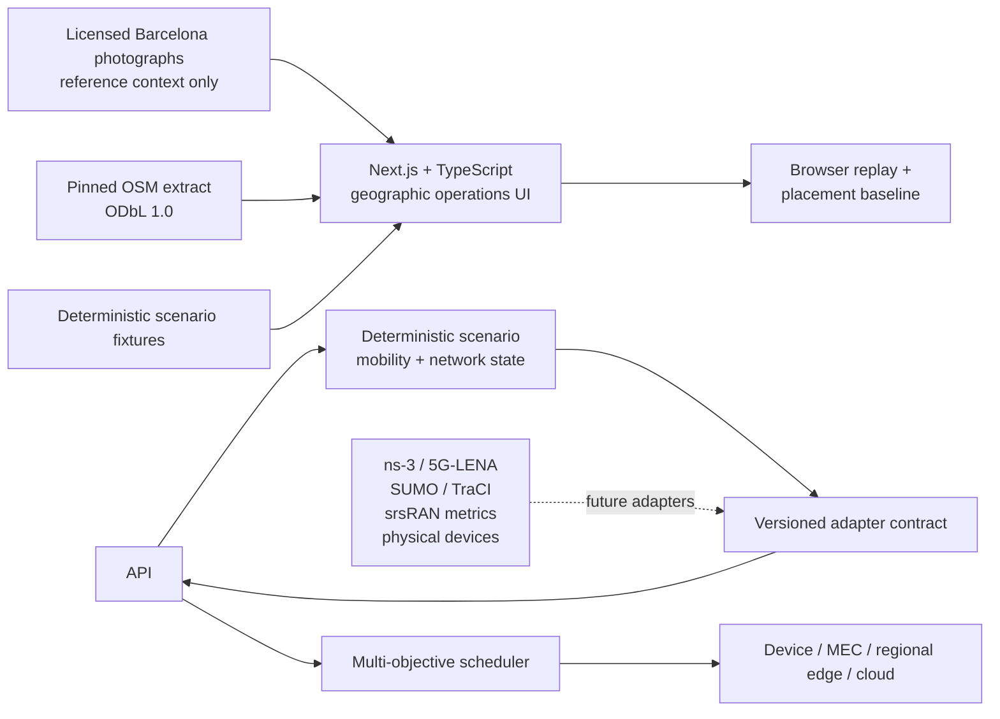

# EdgeTwin

[](https://marinjursic.github.io/EdgeTwin/)
[](https://github.com/MarinJursic/EdgeTwin/actions/workflows/pages.yml)
[](https://nextjs.org/)
[](https://www.typescriptlang.org/)
[](https://www.python.org/)
[](#verification)

An explainable 5G edge-placement workbench that follows a Barcelona camera frame
from capture, through its serving cell, to the compute destination that runs it.

Each scenario opens on a real, licensed street photograph so the place remains
recognizable. A separate checked-in OpenStreetMap extract provides the geographic
evidence view. The interface never plots synthetic network assets on a photograph
as if they were observed. It labels **reference photography**, **observed geography**,
**authored scenario fixtures**, and **locally computed** replay metrics and placement
decisions independently.

## Continuous app walkthrough

[](docs/walkthrough/app-walkthrough.mp4)

[Watch or download the full-resolution MP4](docs/walkthrough/app-walkthrough.mp4)
· [Open the walkthrough poster](docs/walkthrough/app-walkthrough-poster.jpg)

The walkthrough is a single continuous pass through the real application. It starts
with the three-step capture → connect → process story, opens the attributed route
map, selects the serving cell, compares every compute destination under a
privacy-weighted placement policy, returns to the real street context, changes to
the Plaça dense-vision example, reopens the decision explanation, and verifies
both themes.

The displayed values are deterministic simulator telemetry, not packet-level RF
measurements. The continuous capture demonstrates the real interaction and rendering
path without claiming measured 5G performance.

## Why this project exists

Edge-AI scheduling is a systems problem, not just a model-selection problem. Sending a workload farther away may improve inference accuracy while increasing radio delay, privacy exposure, and cost. Keeping it on-device may protect data while draining battery and missing a latency target. EdgeTwin makes those trade-offs observable and gives every decision an inspectable score.

The implemented workbench includes:

- three real, locally bundled Barcelona context photographs with visible source,
  author, capture date, and Creative Commons license;
- a real, attributed OSM street/building extract rather than a synthetic low-poly city;
- three place-specific examples: a Gran Via road hazard, a Plaça Universitat vision burst, and a restricted Balmes camera workload;
- a focused default view that explains workload → serving cell → execution tier in
  one line, with the technical map and asset inventory one action away;
- mouse, touch, wheel, keyboard, and explicit button camera controls;
- selectable UE, gNodeB, and MEC assets with a visible
  reference/observed/authored/computed legend;
- independently selectable device, MEC, regional-edge, and cloud baselines;
- independently adjustable raw latency, energy, cost, privacy-risk, and
  accuracy-loss weights, normalized only while scoring;
- a one-click `gNB-CENTRAL` outage, handover trace, stabilization progress, task reroute, and explicit restoration;
- a deterministic replay with play, pause, step, seek, and speed controls;
- persistent dark and light themes and a downloadable JSON evidence frame;
- a separate deterministic Python simulator, strict telemetry contract, FastAPI
  control plane, and WebSocket stream for programmatic experiments.

No external map service, API key, GPU, SDR, mobile core, or traffic simulator is
required at runtime. The OSM extract ships with the repository.

## Quick start

Prerequisites: Node.js 22.13+ and Python 3.11+.

```bash
# Frontend (lockfile-reproducible)
npm ci
npm run dev
```

In a second terminal:

```bash
python3 -m venv .venv
.venv/bin/pip install -e 'api[test]'
npm run api:dev
```

Open [http://localhost:3000](http://localhost:3000). The static web product runs its
deterministic demonstration kernel locally and does not claim to display live radio
measurements. The optional Python service is an independently testable control plane;
its OpenAPI docs are available at [http://localhost:8000/docs](http://localhost:8000/docs).

## Demo walkthrough

1. Follow the numbered capture → connect → process story, then open **See the
   network route** to view the same frame on attributed map geometry.
2. Read the reference-photo caption, including the source coordinate or explicit
   absence of one and its distance from the scenario center. The photograph is
   nearby city context, not the mapped scene, a live feed, or a simulator input.
3. Drag the map to change bearing, use the wheel or `+`/`−` to zoom, use arrow
   keys to change bearing and pitch, or use the visible camera toolbar.
4. Open **Layers & assets**—this switches to the geographic map—then toggle
   buildings, traffic, radio, compute, and task layers or select a UE, gNodeB, or
   MEC node.
5. Open **Compare every destination** and choose a policy from the single placement-policy
   control. Expand **Tune objective weights** only when a custom policy is needed.
6. Change privacy to **Restricted** and confirm that remote candidates are visibly
   blocked while device placement remains feasible.
7. Select `gNB-CENTRAL`, simulate its outage, inspect the handover and stabilization
   trace, then restore it.
8. Pause, step, seek, and change replay speed; export the current evidence frame.
9. Switch between complete light and dark themes.

The browser trace is deterministic for a given action sequence. Geographic features
come from the local OSM extract; UE routes, traffic states, radio values, cells, MEC
sites, and decisions are scenario data or simulator output.

## Architecture



| Layer | Responsibility |
| --- | --- |
| `public/context/*.jpg` | Real Barcelona reference photographs, deliberately separate from simulated and derived overlays |
| `public/data/barcelona-eixample.geojson` | Deterministic OSM extract with source URL, bbox, timestamp, and ODbL attribution |
| `scripts/import_osm_extract.mjs` | Reproducible OSM XML-to-GeoJSON import and geometry simplification |
| `app/ui/GeoOperationsMap.tsx` | Geographic projection, map layers, route rendering, assets, attribution, and camera controls |
| `app/ui/EdgeTwinDashboard.tsx` | Scenarios, selection, scheduler sheet, incident workflow, evidence export, and replay |
| `app/ui/operationsData.ts` | Three explicit scenario fixtures and simulated network-asset locations |
| `api/edge_twin/contracts.py` | Pydantic telemetry, task, objective, candidate, and scenario contracts |
| `api/edge_twin/scheduler.py` | Feasibility filters and normalized weighted scoring |
| `api/edge_twin/simulator.py` | Seeded mobility, node load, failure, recovery, and telemetry generation |
| `api/edge_twin/adapters.py` | Adapter protocol, validated JSON snapshot adapter, and ns-3/srsRAN seams |

See [Adapter integration guide](docs/ADAPTERS.md) for concrete ns-3, Open5GS, srsRAN, SUMO, and hardware seams.

## Data provenance

| Layer | Classification | Provenance |
| --- | --- | --- |
| streets + buildings | observed geography | OpenStreetMap API extract, bbox `2.1640,41.3862,2.1660,41.3877`, extracted `2026-07-26`, ODbL 1.0 |
| street photographs | nearby reference context | three Wikimedia Commons photographs with per-image attribution and source-location disclosure below; not the mapped scenes, live feeds, or scheduler inputs |
| traffic state + route | scenario fixture | hand-authored deterministic examples aligned to named Eixample streets; not measured or current traffic |
| gNodeBs + MEC + UEs | authored simulated fixture | fixed local scenario assets; not operator topology |
| nominal RSRP + target profiles | authored scenario fixture | fixed demonstration inputs; not RF or operator measurements |
| replay service KPIs | computed from fixtures | deterministic local calculations from target profiles and the authored failure curve |
| placement + task path | computed from fixtures | interpretable weighted ranking after browser placement/privacy gates |

The web app never fetches third-party tiles. `scripts/import_osm_extract.mjs` turns a
bounded OSM XML response into the compact local GeoJSON file and embeds its endpoint,
bbox, extraction time, license, and attribution. The attribution remains visible
inside the map in every theme.

The bundled reference photographs are:

| Scenario | Photograph | Source coordinate | Relationship to scenario center | Creator / license |
| --- | --- | --- | --- | --- |
| Gran Via | [April 2025 Gran Via traffic context](https://commons.wikimedia.org/wiki/File:Apagada_2025_a_Barcelona_-_20250428_171402.jpg) | `41.383820, 2.160500` | approximately 510 m away; not the mapped scene | Pere López Brosa / CC BY-SA 4.0 |
| Plaça Universitat | [Plaça Universitat street context](https://commons.wikimedia.org/wiki/File:Pla%C3%A7a_Universitat_-_20200711_183028.jpg) | `41.384444, 2.163611` | approximately 340 m away; not the mapped scene | Pere López Brosa / CC BY-SA 3.0 |
| Carrer de Balmes | [Barcelona 3495](https://commons.wikimedia.org/wiki/File:Barcelona_3495.JPG) | not published by the source | distance not asserted; not the mapped scene | Freepenguin / CC BY-SA 3.0 |

See [Third-party notices](THIRD_PARTY_NOTICES.md) for license links and reuse details.

## Scheduler

For task \(t\) and candidate node \(n\), the scheduler minimizes:

```text
J(t, n) =
  w_latency  · normalized_latency
+ w_energy   · normalized_energy
+ w_cost     · normalized_monetary_cost
+ w_privacy  · privacy_risk
+ w_accuracy · normalized_accuracy_loss
```

In the web demonstration, placement-policy and privacy gates run before candidate
ranking. Candidate attributes are authored scenario profiles, and the active raw
weight total is normalized only during scoring. A slider therefore preserves the
exact value the operator sets instead of renormalizing the other sliders.
Deterministic tie-breaking uses score, then latency, then node ID; if every browser
weight is zero, latency becomes the tie-break.

The Python API scheduler is a separate, stricter implementation. Before it scores,
deadline, accuracy, privacy, placement, and health constraints remove candidates.
Every API candidate reports machine-readable constraint violations. API weights are
bounded to `[0, 1]`, at least one must be non-zero, and scoring normalizes their sum.
Its analytical latency baseline scales transfer delay with input size and compute
delay with requested GFLOP; it is deliberately simple and calibrated only to the
included deterministic trace.

This MVP intentionally uses an interpretable weighted objective. It is a research baseline for comparison with mixed-integer optimization, contextual bandits, reinforcement learning, and online adaptive control—not a claim of globally optimal production placement.

## Telemetry contract

Every adapter produces the same `TelemetryFrame 1.0`:

```json
{
  "schema_version": "1.0",
  "scenario_id": "gran-via-hazard",
  "tick": 4,
  "seed": 42,
  "generated_at": "2026-07-25T14:32:03.600000Z",
  "source": {
    "name": "deterministic-city-v1",
    "kind": "simulator",
    "contract_version": "1.0"
  },
  "devices": [],
  "nodes": [],
  "metrics": {
    "latency_ms": 58.0,
    "throughput_mbps": 556.0,
    "packet_loss_pct": 2.68,
    "jitter_ms": 10.0,
    "queue_depth": 55,
    "energy_j": 3.8,
    "accuracy_pct": 95.4,
    "privacy_risk": "LOW",
    "sla_pct": 87.2
  },
  "decision": {},
  "slices": [],
  "events": [],
  "failed_base_station": "gNB-CENTRAL"
}
```

Pydantic rejects unknown fields on source measurements and on control requests. `ValidatedSnapshotAdapter` is an executable ingestion boundary, not only an abstract interface: a physical vehicle, camera, Jetson, Raspberry Pi, Android handset, modem, sensor, SDR-backed RAN, or external simulator therefore enters the control plane through validation rather than a source-specific dashboard branch.

## API

| Method | Path | Purpose |
| --- | --- | --- |
| `GET` | `/health` | Liveness and contract version |
| `GET` | `/v1/scenarios` | Deterministic scenario catalog |
| `POST` | `/v1/scenarios/{id}/step` | Advance one tick with objective weights and optional failure |
| `POST` | `/v1/scenarios/{id}/reset` | Reset the scenario tick |
| `POST` | `/v1/schedule` | Score a typed workload against the current node set |
| `WS` | `/v1/scenarios/{id}/stream` | Stream frames at the 0.9-second demo cadence |

Example failure step:

```bash
curl -s http://localhost:8000/v1/scenarios/metro-autonomy-01/step \
  -H 'content-type: application/json' \
  -d '{
    "failure": "gnb-central",
    "privacy_class": "internal",
    "placement_policy": "adaptive",
    "objective_weights": {
      "latency": 0.42,
      "energy": 0.20,
      "monetary_cost": 0.10,
      "privacy_risk": 0.18,
      "accuracy_loss": 0.10
    }
  }'
```

`placement_policy` accepts `adaptive`, `device_only`, `edge_only`, or
`cloud_only`. `privacy_class` accepts `public`, `internal`, `sensitive`, or
`restricted`. A forced policy that conflicts with privacy, health, accuracy, or
deadline constraints returns HTTP `422` with an executable reason instead of
silently violating the invariant. WebSocket clients receive isolated seeded
replays and do not advance HTTP-controlled state or another client’s stream.

## Verification

```bash
# Production frontend compilation
npm run build

# Server-rendered product smoke test
npm test

# TypeScript/React lint
npm run lint

# TypeScript contract check
npm run typecheck

# Frontend domain, interaction, and server-render tests
npm test

# Python lint/format plus FastAPI, strict schema, adapter, privacy, policy,
# HTTP, WebSocket, late-failure, restoration, and deterministic replay tests
.venv/bin/ruff check api scripts
.venv/bin/ruff format --check api scripts
cd api && ../.venv/bin/pytest

# All build and test checks
npm run test:all
```

The automated suite checks byte-for-byte reset determinism (including generated timestamps), every device and execution tier, complete telemetry dimensions, late-injected failure behavior, UE reassignment, stabilization and restoration, weighted and forced policies, strict privacy, task-size sensitivity, requesting-device identity, candidate explanations, malformed and unknown HTTP requests, zero/invalid weights, 404s, isolated WebSocket streams and close codes, hardware snapshot validation, custom-weight browser-fallback scheduling, operator controls, persistent theme selection, light-theme propagation into the geographic map, outage inventory, accessible recovery progress, and server-rendered product content.

## Research framing

The next research phase should compare policies under the same recorded traces:

1. device-only, edge-only, and cloud-only;
2. greedy minimum-latency placement;
3. rule-based privacy/deadline routing;
4. the weighted adaptive baseline included here;
5. mixed-integer optimization with a bounded solve budget;
6. reinforcement learning or contextual bandits;
7. online adaptation under non-stationary load and failure.

Recommended evaluation dimensions:

- deadline-hit and slice-SLA rate;
- p50/p95/p99 end-to-end latency and jitter;
- device joules per successful inference;
- monetary cost per 1,000 tasks;
- privacy-policy violations;
- accuracy loss relative to the largest model;
- handover and migration interruption;
- queue stability and recovery time after a gNodeB/MEC failure;
- decision overhead and regret versus an offline oracle.

Run every policy on identical seeded traces and report confidence intervals. Separate simulator fidelity, scheduler performance, and visualization performance; improving one does not prove improvement in the others.

## Standards and primary sources

- ETSI's current MEC framework separates MEC applications, platform services,
  host-level management, and system-level orchestration; EdgeTwin keeps its
  laptop-scale MEC nodes and scheduler visibly distinct for the same reason:
  [ETSI GS MEC 003 V4.1.1](https://www.etsi.org/deliver/etsi_gs/mec/001_099/003/04.01.01_60/gs_mec003v040101p.pdf).
- 3GPP's edge-computing overview separates the application, edge-enabler, hosting,
  management, and transport layers and describes the alignment between 3GPP edge
  enablers and ETSI MEC. The UI consequently presents application placement and
  network transport as related but different evidence:
  [3GPP Edge Computing](https://www.3gpp.org/technologies/edge-computing).
- O-RAN WG3 defines the Near-RT RIC as a fine-grained data-collection and action
  loop over E2. EdgeTwin does not claim to implement a RIC or E2 interface; those remain
  adapter targets:
  [O-RAN technical groups](https://www.o-ran.org/technical-groups).
- 3GPP's 5G system overview identifies edge computing and slicing as distinct
  architectural capabilities. The three dashboard slices are therefore
  workload/SLA views, not separate radio towers or a claim of complete PLMNs:
  [3GPP 5G System Overview](https://www.3gpp.org/technologies/5g-system-overview).
- 3GPP identifies Release 18 as the first release of **5G-Advanced**: [3GPP Highlights, Release 18](https://www.3gpp.org/ftp/Information/Highlights/2022_Issue05/3GPP_Highlights_Issue_5_WEB.pdf).
- 5G-LENA is the ns-3 NR module. NR-v5.0 is paired with ns-3.48; its
  release notes also warn FDD users to apply ns-3 MR 2929 for an NLOS
  spectrum-model issue that can understate received power:
  [5G-LENA v5.0 release notes](https://cttc-lena.gitlab.io/nr/html/md__2builds_2cttc-lena_2nr_2_r_e_l_e_a_s_e___n_o_t_e_s.html).
- Open5GS implements a 5G Core/EPC and documents SA/NSA network functions and deployment: [Open5GS documentation](https://open5gs.org/open5gs/docs/).
- srsRAN provides a portable open-source 5G CU/DU stack; its metrics can be emitted as JSON over WebSocket: [srsRAN Project documentation](https://docs.srsran.com/projects/project/en/latest/) and [output documentation](https://docs.srsran.com/projects/project/en/latest/user_manuals/source/outputs.html).
- SUMO is a microscopic traffic simulator; TraCI provides TCP client/server control and online access to simulation objects: [Eclipse SUMO](https://eclipse.dev/sumo/) and [TraCI documentation](https://eclipse.dev/sumo/docs/TraCI/index.html).
- OpenTelemetry recommends counters such as `system.network.packet.dropped`,
  `system.network.packet.count`, and `system.network.errors` for measured host
  interface telemetry. The included `TelemetryFrame` remains a domain contract;
  a production OpenTelemetry exporter should map measured counters explicitly
  instead of renaming the demo's analytical percentages:
  [OpenTelemetry system metric semantic conventions](https://opentelemetry.io/docs/specs/semconv/system/system-metrics/).
- OpenStreetMap requires visible attribution and identification of the ODbL;
  the map carries both and the extract retains its provenance:
  [OpenStreetMap copyright and license](https://www.openstreetmap.org/copyright).

These tools are integration targets, not bundled dependencies. Keeping them behind adapters preserves the laptop-friendly demo and prevents simulator-specific types from leaking into the scheduler or UI.

## Current limitations

- Radio coverage is an explanatory visualization, not a calibrated ray-traced RF prediction.
- Link and queue dynamics are deterministic analytical signals, not packet-level ns-3 output.
- The scheduler is a transparent weighted heuristic, not a mixed-integer,
  reinforcement-learning, or globally optimal controller. It uses hand-tuned
  normalization constants; production use requires trace-derived calibration.
- The walkthrough records the UI rendering deterministic simulator telemetry. It
  demonstrates product flow and state transitions, not measured 5G performance.
- Authentication, durable telemetry storage, multi-tenant isolation, admission control, and rate limiting are out of scope.
- The WebSocket endpoint streams an isolated no-failure baseline; bidirectional stream control is intentionally not implemented, while controlled experiments use the typed HTTP step endpoint.
- The default photography is representative place context, not georeferenced
  evidence, current traffic, or a camera input. It is never used for placement.
- The technical map uses a compact vector extract and a lightweight projection; it
  is not a full GIS engine and intentionally omits turn-by-turn routing and terrain.
- Open5GS, srsRAN, ns-3/5G-LENA, and SUMO are documented adapter seams and are not installed automatically.

## Repository layout

```text
.
├── app/                  Next.js geographic operations UI
├── api/
│   ├── edge_twin/        contracts, adapters, scheduler, simulator, FastAPI
│   └── tests/            API and scheduling tests
├── docs/                 integration notes and continuous app walkthrough media
├── public/data/          attributed local OSM GeoJSON extract
├── scripts/              OSM importer and reproducible utilities
├── tests/                interaction, theme, domain, and SSR tests
└── README.md
```

## License

[MIT](LICENSE)
